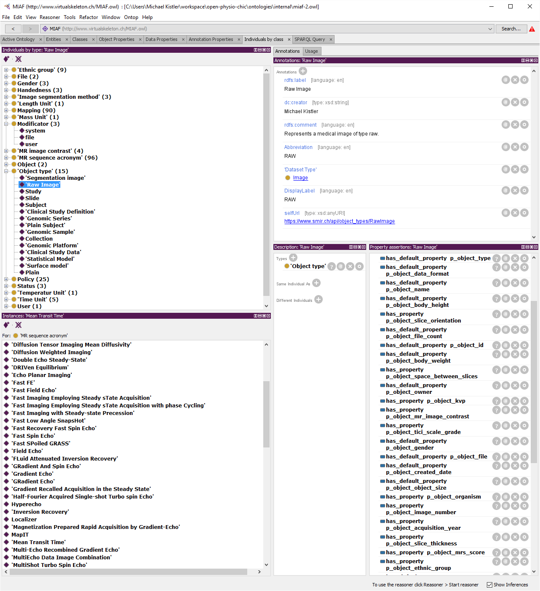

# miaf-ontology
Medical image annotation framework Ontology. Use on SMIR.ch and in the VSD Framework to annotate medical imaging data. It consist of terms (incl. original IRI) from other existing ontolgies and MIAF terms. It is used to fill meta data in the VSD framework which is used by SICAS to host the SICAS Medical Image Repository.

## Introduction
 Goal: achieve u
 retrieve meta-data from a defined vocabular. For this reason, we have collected a specific vocabulary from different ontologies into a single ontology. but we also like to use a triple store for quering the meta-data. Therefore, this ontology consists of 3 parts needed for a triple store:

 - subject: an individual of an `independent entity`
 - predicate: an individual of  `internal entity >> Mapping`
 - object : `object property` or `text`

## Structure
### Classes
#### SMIR classes

`Domain entity -> Independent entity`

-   Generic Object -> Object
-   File
-   Group
-   User

#### Internal classes

`Domain entity -> Internal entity`

Is used internal representation of VSD framework structures

- Mapping
- Status
- Modificator

#### Objects classes

`Domain entity -> Object property`

Property values that are used to annotate an object with a predefined values. The terms are collected from various sources and its structure recreated. The last level (things to use to annotate) are most likely to be instances. Here a (incomplete) list of object property terms :

-   Gender (instances):
-   Title (honorific Prefix, classes)
-   License (Policy, instances):
-   Segmentation method (instances)
-   MR contrast (instances)
-   Mr sequences acronyms (instances)
-   Modalities (classes)
-   Ethnic group (instances)
-   Format (classes)
-   Dominance (Handedness)
-   Organism (classes)
-   Units (instances)
-   Anatomical region -> FMA

### Properties
#### Object properties
if multiple instances are need or mappes other instances (value lists, icenses, modality etc.)

examples:
- has_anatomical_region >> fma instance
- has_gender >> gender instance
- has_modality >> modality instance

#### Data properties

with a datatype string, integer, uri etc. most commonly used. But not applicable to classes. That means it is not a generic property of an `Independent entity`

**Examples**
- age
- lastname
- rating

#### Annotation properties

It is either generic describe classes/properties, generic to all objects,  or has a class as Range

** Example**
- Label (generic)
- Abbreviation (generic)
- DisplayLabel (generic)
- selfUrl (objects)


## Extending

** Look for already defined ontology classes**:
- http://aber-owl.net/ontology
- https://www.ebi.ac.uk/ols/
- http://bioportal.bioontology.org/
- http://swoogle.umbc.edu


** Make sure the new entity option is using the setting "use iri of active ontology" **


### `Subjects`
Subjects dont have to be created as they are only needed in the triple store. However, MIAF contains some examples:
- 2 Object instances
- 1 file instance
- 1 user instance


### Add `Object`
1. create the class (structure) to the `Object property` class using the external `IRI`
2. add the list as instance (using external `IRI` )
3. add `Annotation properties`
  - `Label`: Name of the object. *Required*
  - `Abbreviation`: If available
  - `Comment`: general comment
  - `Description`: description of the meaning of the term
  - `DisplayLabel`: The label that will be displayed


### Add `Predicates` to object types <span id="types"></span>
1. decide what typ of property (see above)
  - `Object property`
  - `Data property`
  - `Annotation property`
2. Create the property using the external `IRI` if available
3. Add `Annotation properties`
  - `Label`: Name of the object. *Required*
  - `Abbreviation`: If available
  - `Comment`: general comment
  - `Description`: description of the meaning of the term
  - `DisplayLabel`: The label that will be displayed
4. to define if a new predicate is default `has_default_property` or is standard `has_property`

`has_default_property or has_property + the new predicate`




### Add Mapping
1. add instance of class `Mapping`
2. Add `Annotation property`
  - label: `p_object_new_property`
  - annotation property: `MappingTo` and add the correct `Property`
3. add property assertion `has_property_modificator` [user|system|file]


#### addon: default mappings for new object types
If you add a new object type, you can use the xml below to add it later in the owl file directly. change `db7925ac_a8f1_47a8_860f_0cdb9ed18b5f` to the desired indivdual (object type) and add it directly to the owl for a new object type

```xml
    <ObjectPropertyAssertion>
        <ObjectProperty IRI="#d88fc04d_8920_4f54_ad17_b9094e13865a"/>
        <NamedIndividual IRI="#db7925ac_a8f1_47a8_860f_0cdb9ed18b5f"/>
        <NamedIndividual IRI="#a4330bca_7b02_432d_8d89_787c0027cd0e"/>
    </ObjectPropertyAssertion>
    <ObjectPropertyAssertion>
        <ObjectProperty IRI="#d88fc04d_8920_4f54_ad17_b9094e13865a"/>
        <NamedIndividual IRI="#db7925ac_a8f1_47a8_860f_0cdb9ed18b5f"/>
        <NamedIndividual IRI="#ac1e9418_cf1e_471b_9e44_ea7f71069698"/>
    </ObjectPropertyAssertion>
    <ObjectPropertyAssertion>
        <ObjectProperty IRI="#d88fc04d_8920_4f54_ad17_b9094e13865a"/>
        <NamedIndividual IRI="#db7925ac_a8f1_47a8_860f_0cdb9ed18b5f"/>
        <NamedIndividual IRI="#b3081f13_637b_4319_befb_8a623de26b31"/>
    </ObjectPropertyAssertion>
    <ObjectPropertyAssertion>
        <ObjectProperty IRI="#d88fc04d_8920_4f54_ad17_b9094e13865a"/>
        <NamedIndividual IRI="#db7925ac_a8f1_47a8_860f_0cdb9ed18b5f"/>
        <NamedIndividual IRI="#cb25f8e6_95b0_4c23_b1d4_0128b7c337a5"/>
    </ObjectPropertyAssertion>
    <ObjectPropertyAssertion>
        <ObjectProperty IRI="#d88fc04d_8920_4f54_ad17_b9094e13865a"/>
        <NamedIndividual IRI="#db7925ac_a8f1_47a8_860f_0cdb9ed18b5f"/>
        <NamedIndividual IRI="#f63fc9ba_3ee2_4d3c_aaec_6d268bfd0097"/>
    </ObjectPropertyAssertion>
    <ObjectPropertyAssertion>
        <ObjectProperty IRI="#d88fc04d_8920_4f54_ad17_b9094e13865a"/>
        <NamedIndividual IRI="#db7925ac_a8f1_47a8_860f_0cdb9ed18b5f"/>
        <NamedIndividual IRI="#0e0500a5_2492_4f95_a055_1c969a6552fe"/>
    </ObjectPropertyAssertion>
    <ObjectPropertyAssertion>
        <ObjectProperty IRI="#d88fc04d_8920_4f54_ad17_b9094e13865a"/>
        <NamedIndividual IRI="#db7925ac_a8f1_47a8_860f_0cdb9ed18b5f"/>
        <NamedIndividual IRI="#10dcdaf9_6bdb_4b1f_bda7_2c46e5f1c29d"/>
    </ObjectPropertyAssertion>
    <ObjectPropertyAssertion>
        <ObjectProperty IRI="#d88fc04d_8920_4f54_ad17_b9094e13865a"/>
        <NamedIndividual IRI="#db7925ac_a8f1_47a8_860f_0cdb9ed18b5f"/>
        <NamedIndividual IRI="#213634ed_fec9_4f36_9e79_228f46642e87"/>
    </ObjectPropertyAssertion>
    <ObjectPropertyAssertion>
        <ObjectProperty IRI="#d88fc04d_8920_4f54_ad17_b9094e13865a"/>
        <NamedIndividual IRI="#db7925ac_a8f1_47a8_860f_0cdb9ed18b5f"/>
        <NamedIndividual IRI="#34127d03_aea2_4a24_871c_6f7e9ac72823"/>
    </ObjectPropertyAssertion>
    <ObjectPropertyAssertion>
        <ObjectProperty IRI="#d88fc04d_8920_4f54_ad17_b9094e13865a"/>
        <NamedIndividual IRI="#db7925ac_a8f1_47a8_860f_0cdb9ed18b5f"/>
        <NamedIndividual IRI="#57930446_dc48_4445_9615_d0e08f3a7dac"/>
    </ObjectPropertyAssertion>
    <ObjectPropertyAssertion>
        <ObjectProperty IRI="#d88fc04d_8920_4f54_ad17_b9094e13865a"/>
        <NamedIndividual IRI="#db7925ac_a8f1_47a8_860f_0cdb9ed18b5f"/>
        <NamedIndividual IRI="#8a20edb0_c831_4dbf_9e06_fec8c583a39e"/>
    </ObjectPropertyAssertion>
    <ObjectPropertyAssertion>
        <ObjectProperty IRI="#d88fc04d_8920_4f54_ad17_b9094e13865a"/>
        <NamedIndividual IRI="#db7925ac_a8f1_47a8_860f_0cdb9ed18b5f"/>
        <NamedIndividual IRI="#8bcdf331_a3e2_4764_bc44_40d0f22d856f"/>
    </ObjectPropertyAssertion>
    <ObjectPropertyAssertion>
        <ObjectProperty IRI="#d88fc04d_8920_4f54_ad17_b9094e13865a"/>
        <NamedIndividual IRI="#db7925ac_a8f1_47a8_860f_0cdb9ed18b5f"/>
        <NamedIndividual IRI="#8da83cb0_8c7f_4de3_8f33_53806f782f79"/>
    </ObjectPropertyAssertion>
    <ObjectPropertyAssertion>
        <ObjectProperty IRI="#d88fc04d_8920_4f54_ad17_b9094e13865a"/>
        <NamedIndividual IRI="#db7925ac_a8f1_47a8_860f_0cdb9ed18b5f"/>
        <NamedIndividual IRI="#859670b5_8337_4f2d_8473_a2761b49e09f"/>
    </ObjectPropertyAssertion>
    <ObjectPropertyAssertion>
        <ObjectProperty IRI="#d88fc04d_8920_4f54_ad17_b9094e13865a"/>
        <NamedIndividual IRI="#db7925ac_a8f1_47a8_860f_0cdb9ed18b5f"/>
        <NamedIndividual IRI="#908630bc_610b_47cd_9cc1_ad7b2e2a1e75"/>
    </ObjectPropertyAssertion>
```
## Usage with VSD

### Mapping file
- create the mapping `json`: read `sop-create-mapping-file.md` file

### Get the value list
- if the list is has subcategories, use the subclasses and add `Abbreviation` to the terms that should appear in the list.
-> example for sequence: `Turbo Spin Echo (TSE)`

find some queries here `doc/miaf-queries.md`
