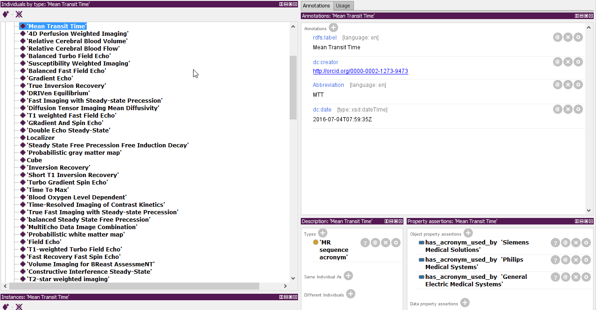
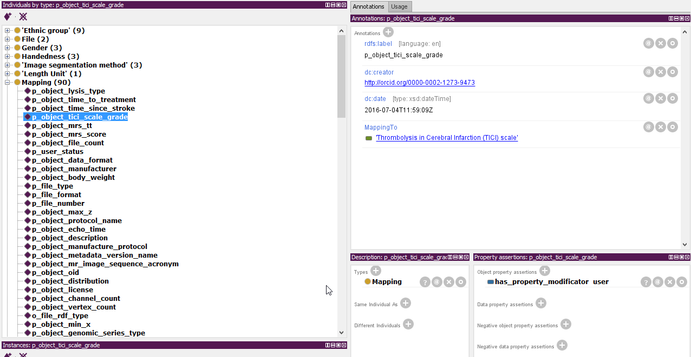

# SOP - How to add new vocabulary to MIAF ontology

## How to add new MR sequence acronym

- Look up the existing term for it (research a bit) [here](http://www.revisemri.com/questions/misc/mri_abbrev) and [here](http://www.mr-tip.com/serv1.php?type=cam)
- Open Protege
- add new instance in MR sequence acronyms
- add the `rdfs:label`
- add `Abbreviation`
- and if known: add `has_acronym_used_by' as `object property annotations`

## How to add a new predicate (object property, data property, annotation property)

1. research on [OLS](https://www.ebi.ac.uk/ols/index), [AberOWL](http://aber-owl.net/ontology/), [Bioportal](http://bioportal.bioontology.org/), [swoogle](http://swoogle.umbc.edu/) and the web
2. add the new predciate property >> [see predicate](#predicate)
3. add a mapping to Mappings class as data property, annotation property etc >> [see mapping](#mapping)
4. add values (if predefined exist) [see value list](#value)
5. add the mapping to the object type instance [see object types](#types)

### example data property 

- Label: Thrombolysis in Cerebral Infarction (TICI) perfusion scale grade
- DisplayLabel: TICI Scale Grade
- seeAlso: https://dictionary.fitbir.nih.gov/portal/publicData/dataElementAction!view.action?dataElementName=TICIPerfScaleGrade&publicArea=true

### predicate mapping instance 

- Label: p_object_tici_score
- MappingTo: Thrombolysis in Cerebral Infarction (TICI) perfusion scale grade
- object property: `has_property_modificator` + `[system | user | file]`
    - system: generated by system and modification
    - user: user entry and modification
    - file: taken from the data file, not changeable by user or system

###  How to add "value lists" 

- create a category class in `Object property`
- add the list as instance
- if the list is has subcategories, use the subclasses and add `Abbreviation` to the terms that should appear in the list

### add to object types 
to define is a new predicate is default or at least known to the type, add a object property:

- has_default_property or has_property + the new predicate

