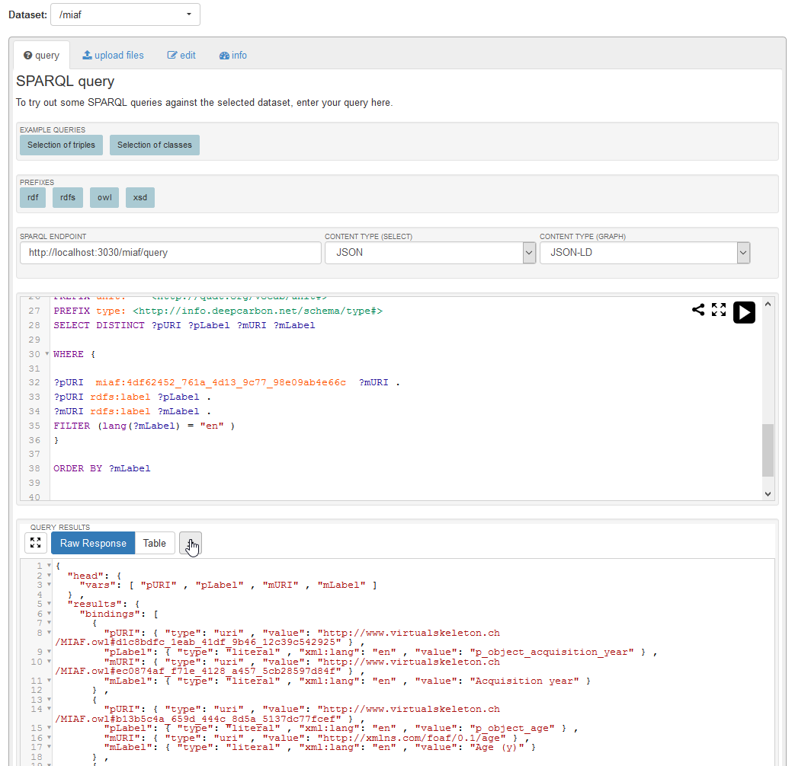

# SOP: generate mapping file for SMIR

1. Save ontology as .rdf (From Protege)
2. start fuseki and go to localhost:3030
3. create or open the miaf dataset
4. upload the new .rdf file
5. use sparql query to get the list
6. select json and raw as output and save the file


## query

```sql
PREFIX rdf:     <http://www.w3.org/1999/02/22-rdf-syntax-ns#>
PREFIX owl:     <http://www.w3.org/2002/07/owl#>
PREFIX rdfs:    <http://www.w3.org/2000/01/rdf-schema#>
PREFIX xsd:     <http://www.w3.org/2001/XMLSchema#>
PREFIX dct:     <http://purl.org/dc/terms/>
PREFIX foaf:    <http://xmlns.com/foaf/0.1/>
PREFIX miaf:    <http://www.virtualskeleton.ch/MIAF.owl#>
PREFIX ns1:     <http://virtualskeleton.ch/data/fma>
PREFIX fma:     <http://purl.org/sig/ont/fma/>
PREFIX odrl:    <http://www.w3.org/ns/odrl/2/>
PREFIX mrda:    <http://neurolog.unice.fr/ontoneurolog/v3.0/ontoneurolog-mr-dataset-acquisition.owl#>
PREFIX obo:     <http://purl.obolibrary.org/obo/>
PREFIX obi:     <http://purl.obolibrary.org/obo/OBI_>
PREFIX ero:     <http://purl.obolibrary.org/obo/ERO_>
PREFIX obcs:    <http://purl.obolibrary.org/obo/OBCS_>
PREFIX pato:    <http://purl.obolibrary.org/obo/PATO_>
PREFIX uberon:  <http://purl.obolibrary.org/obo/uberon/core#>
PREFIX edam:    <http://edamontology.org/>
PREFIX sio:     <http://semanticscience.org/resource/>
PREFIX bim:     <http://cbakerlab.unbsj.ca:8080/sebi/BIM.owl#>
PREFIX birnlex: <http://bioontology.org/projects/ontologies/birnlex#>
PREFIX csp:     <http://purl.bioontology.org/ontology/CSP/>
PREFIX dcm:     <http://dicom.nema.org/resources/ontology/DCM/>
PREFIX vocab:   <http://open.vocab.org/terms/>
PREFIX lic:     <http://purl.org/NET/rdflicense/>
PREFIX sedi:    <http://semantic-dicom.org/dcm#>
PREFIX unit:    <http://qudt.org/vocab/unit#>
PREFIX ncit:    <http://ncicb.nci.nih.gov/xml/owl/EVS/Thesaurus.owl#>

SELECT DISTINCT ?pURI ?pLabel ?mURI ?mLabel

WHERE {

?pURI  miaf:4df62452_761a_4d13_9c77_98e09ab4e66c  ?mURI .
?pURI rdfs:label ?pLabel .
?mURI rdfs:label ?mLabel .
FILTER (lang(?mLabel) = "en" )
}

ORDER BY ?mLabel
```

## fuseki


